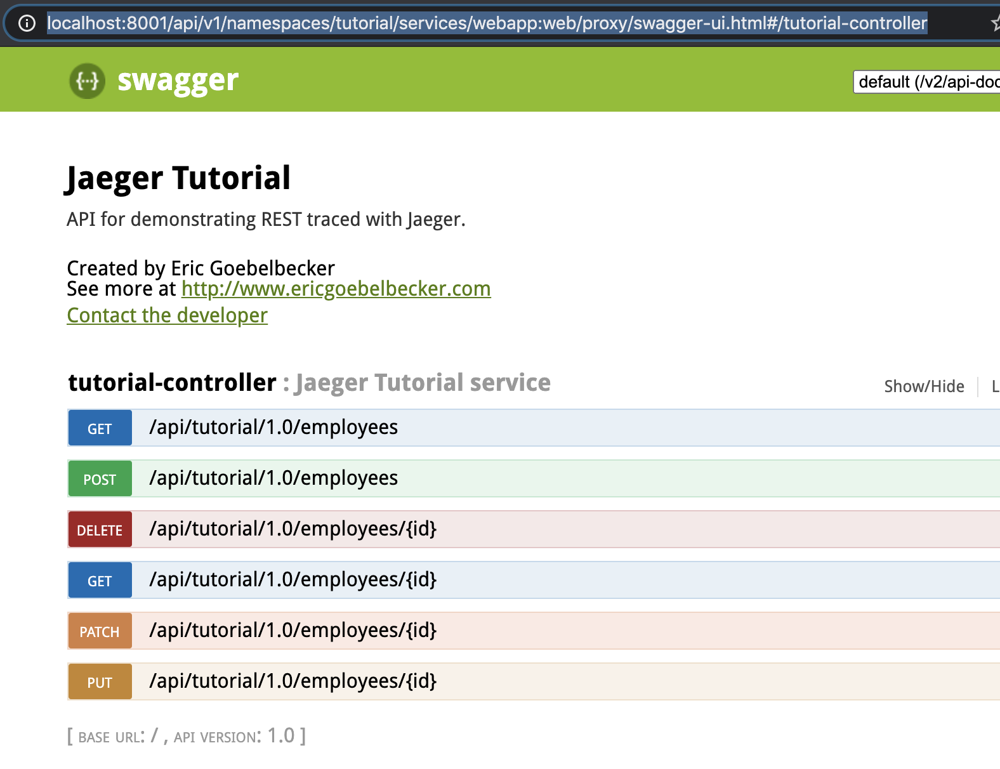

# Jaeger Tutorial

Thanks to @egoebelbecker. This repo is based on https://github.com/egoebelbecker/jaeger-tutorial/

## 部署
目前`istio-system` namespace 下的`istio-tracing` 即为 jager 的deploymen。对应的 service 为：
```
jaeger-agent
jaeger-collector
jaeger-collector-headless
jaeger-query
```
为了收集埋点信息，只要发送给`jaeger-agent`， FQDN 为 `jaeger-dev-agent.observability.svc.cluster.local`。

本项目的代码已经构建为容器镜像`hyge/jaegertutorial:v1`，只需用该镜像创建应用：
```
kubectl create namespace tutorial
kubectl apply -n tutorial -f - <<EOF
apiVersion: apps/v1 # for versions before 1.9.0 use apps/v1beta2
kind: Deployment
metadata:
  name: webapp
spec:
  selector:
    matchLabels:
      app: webapp
  replicas: 1
  template:
    metadata:
      labels:
        app: webapp
    spec:
      containers:
      - name: webapp
        image: hyge/jaegertutorial:v1
        ports:
        - containerPort: 8080
        env:
        - name: JAEGER_AGENT_HOST
          value: jaeger-agent.istio-system.svc.cluster.local
---
apiVersion: v1
kind: Service
metadata:
  name: webapp
  labels:
    name: webapp
spec:
  ports:
  - port: 8080
    targetPort: 8080
    name: web
  selector:
    app: webapp
EOF
```

### 访问jaegertutorial应用
可以通过ingress暴露服务，也可以执行 `kubectl proxy` 代理到本地，然后访问应用 http://localhost:8001/api/v1/namespaces/tutorial/services/webapp:web/proxy/swagger-ui.html#/tutorial-controller


